---
hide:
  - navigation
  - toc
---

# Supported Agents

Agent Skill Router integrates with every major AI coding agent. Each agent has two roles:

1. **Skill provider** — a directory where the router looks for skills (SKILL.md directories)
2. **Setup provider** — a config file where `setup-mcp` writes the MCP server entry

---

## Skill directory providers

For each agent, the router scans two scopes: workspace (project-local) and user (global).
Both scopes are enabled by default and can be toggled independently via environment variables.

| Agent | Env toggle | Workspace skill path | User skill path |
|---|---|---|---|
| **Claude** | `SKILL_ROUTER_ENABLE_CLAUDE` | `<ws>/.claude/skills/` | `~/.claude/skills/` |
| **Cursor** | `SKILL_ROUTER_ENABLE_CURSOR` | `<ws>/.cursor/skills/` | `~/.cursor/skills/` |
| **VS Code / Copilot** | `SKILL_ROUTER_ENABLE_VSCODE` | `<ws>/.copilot/skills/` | `~/.copilot/skills/` |
| **GitHub Copilot** | `SKILL_ROUTER_ENABLE_COPILOT` | `<ws>/.copilot/skills/` | `~/.copilot/skills/` |
| **Codex** | `SKILL_ROUTER_ENABLE_CODEX` | `<ws>/.codex/skills/` | `/etc/codex/skills/`, `~/.codex/skills/` |
| **Gemini** | `SKILL_ROUTER_ENABLE_GEMINI` | `<ws>/.gemini/skills/` | `~/.gemini/skills/` |
| **Goose** | `SKILL_ROUTER_ENABLE_GOOSE` | `<ws>/.goose/skills/` | `~/.config/agents/skills/` |
| **OpenCode** | `SKILL_ROUTER_ENABLE_OPENCODE` | `<ws>/.opencode/skills/` | `~/.config/opencode/skills/` |
| **Generic (.agents)** | `SKILL_ROUTER_ENABLE_AGENTS` | `<ws>/.agents/skills/` | `~/.agents/skills/` |
| **OpenClaw** | `SKILL_ROUTER_ENABLE_OPENCLAW` | `<ws>/.openclaw/skills/` | `~/.openclaw/skills/` |
| **Bundled** | `SKILL_ROUTER_ENABLE_BUNDLED` | — | `<package>/skills/` |

`<ws>` = git repository root (or current directory if not in a repo), or the value of `--workspace-dir` / `SKILL_ROUTER_WORKSPACE_DIR`.

!!! tip "Recommendation: use `.agents/skills/`"
    The generic `.agents/skills/` path is agent-agnostic. Skills placed here are discovered regardless of which agent the user is running, making it the best default location for shared project skills.

---

## Discovery order

Providers are scanned in a fixed order. When the same skill name appears in multiple providers, the **first one wins**:

```mermaid
flowchart LR
    P1["1. Claude\n.claude/skills/"]
    P2["2. Cursor\n.cursor/skills/"]
    P3["3. VSCode\n.copilot/skills/"]
    P4["4. Codex\n.codex/skills/"]
    P5["5. Gemini\n.gemini/skills/"]
    P6["6. Goose\n.goose/skills/"]
    P7["7. Copilot\n.copilot/skills/"]
    P8["8. OpenCode\n.opencode/skills/"]
    P9["9. Agents\n.agents/skills/"]
    P10["10. OpenClaw\n.openclaw/skills/"]
    P11["11. Bundled\n(package)"]

    P1 --> P2 --> P3 --> P4 --> P5 --> P6 --> P7 --> P8 --> P9 --> P10 --> P11
```



Each level is scanned first for workspace paths, then user paths (when both scopes are enabled).

---

## Agent setup providers

These providers handle the `setup-mcp` CLI command and native slash-command file parsing.

### Claude

| | |
|---|---|
| **CLI name** | `claude` |
| **Workspace config** | `.claude/mcp.json` |
| **User config** | `~/.claude/mcp.json` |
| **Slash commands** | `.claude/commands/*.md` |
| **Automated install** | Yes |

=== "Automated setup"
    ```bash
    agent-skill-router setup-mcp claude
    ```

=== "Manual config (`.claude/mcp.json`)"
    ```json
    {
      "mcpServers": {
        "agent-skill-router": {
          "command": "uvx",
          "args": ["agent-skill-router", "run"]
        }
      }
    }
    ```

---

### GitHub Copilot

| | |
|---|---|
| **CLI name** | `github-copilot` |
| **Workspace config** | `.vscode/mcp.json` |
| **User config** | `~/.vscode/mcp.json` |
| **Slash commands** | `.github/prompts/*.prompt.md` |
| **Automated install** | Yes |

=== "Automated setup"
    ```bash
    agent-skill-router setup-mcp github-copilot
    ```

=== "Manual config (`.vscode/mcp.json`)"
    ```json
    {
      "servers": {
        "agent-skill-router": {
          "type": "stdio",
          "command": "uvx",
          "args": ["agent-skill-router", "run"]
        }
      }
    }
    ```

---

### Cursor

| | |
|---|---|
| **CLI name** | `cursor` |
| **Workspace config** | `.cursor/mcp.json` |
| **User config** | `~/.cursor/mcp.json` |
| **Slash commands** | `.cursor/rules/*.mdc`, `.cursor/rules/*.md` |
| **Automated install** | Yes |

=== "Automated setup"
    ```bash
    agent-skill-router setup-mcp cursor
    ```

=== "Manual config (`.cursor/mcp.json`)"
    ```json
    {
      "mcpServers": {
        "agent-skill-router": {
          "command": "uvx",
          "args": ["agent-skill-router", "run"]
        }
      }
    }
    ```

---

### OpenCode

| | |
|---|---|
| **CLI name** | `opencode` |
| **Workspace config** | `.opencode/mcp.json` |
| **User config** | `~/.config/opencode/opencode.json` |
| **Slash commands** | `.opencode/commands/*.md` |
| **Automated install** | Yes |

=== "Automated setup"
    ```bash
    agent-skill-router setup-mcp opencode
    ```

=== "Manual config (`.opencode/mcp.json`)"
    ```json
    {
      "mcp": {
        "agent-skill-router": {
          "type": "local",
          "command": "uvx",
          "args": ["agent-skill-router", "run"]
        }
      }
    }
    ```

---

### Gemini

| | |
|---|---|
| **CLI name** | `gemini` |
| **Workspace config** | `.gemini/settings.json` |
| **User config** | `~/.gemini/settings.json` |
| **Slash commands** | `.gemini/commands/**/*.toml` |
| **Automated install** | Yes |

=== "Automated setup"
    ```bash
    agent-skill-router setup-mcp gemini
    ```

=== "Manual config (`.gemini/settings.json`)"
    ```json
    {
      "mcpServers": {
        "agent-skill-router": {
          "command": "uvx",
          "args": ["agent-skill-router", "run"]
        }
      }
    }
    ```

---

### Goose

| | |
|---|---|
| **CLI name** | `goose` |
| **Workspace config** | `.goose/mcp.json` |
| **User config** | `~/.config/goose/config.yaml` |
| **Slash commands** | `.goose/recipes/*.yaml` |
| **Automated install** | Yes |

=== "Automated setup"
    ```bash
    agent-skill-router setup-mcp goose
    ```

=== "Manual config (`~/.config/goose/config.yaml`)"
    ```yaml
    extensions:
      agent-skill-router:
        type: stdio
        cmd: uvx
        args:
          - agent-skill-router
          - run
        enabled: true
    ```

---

### Codex

| | |
|---|---|
| **CLI name** | `codex` |
| **Workspace config** | `.codex/config.toml` |
| **User config** | `~/.codex/config.toml` |
| **Slash commands** | `.codex/prompts/*.md` |
| **Automated install** | Yes |

=== "Automated setup"
    ```bash
    agent-skill-router setup-mcp codex
    ```

=== "Manual config (`.codex/config.toml`)"
    ```toml
    [[mcp_servers]]
    name = "agent-skill-router"
    command = "uvx"
    args = ["agent-skill-router", "run"]
    ```

---

## Auto-discover all agents

Run without an agent name to configure every supported agent at once:

```bash
# Workspace-level configs (default)
agent-skill-router setup-mcp

# User-level configs (global, applies to all projects)
agent-skill-router setup-mcp --user
```

Providers that do not support automated install are silently skipped.
