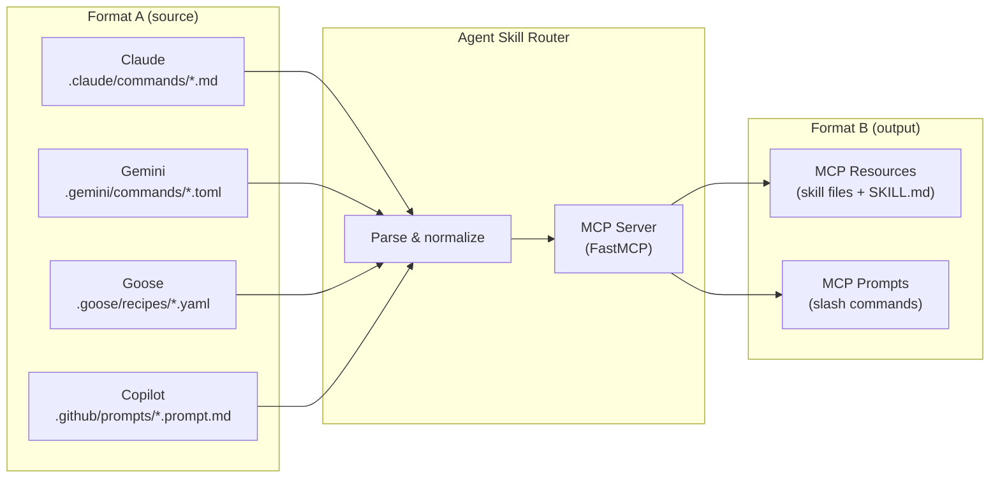
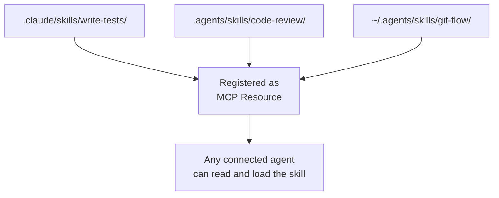
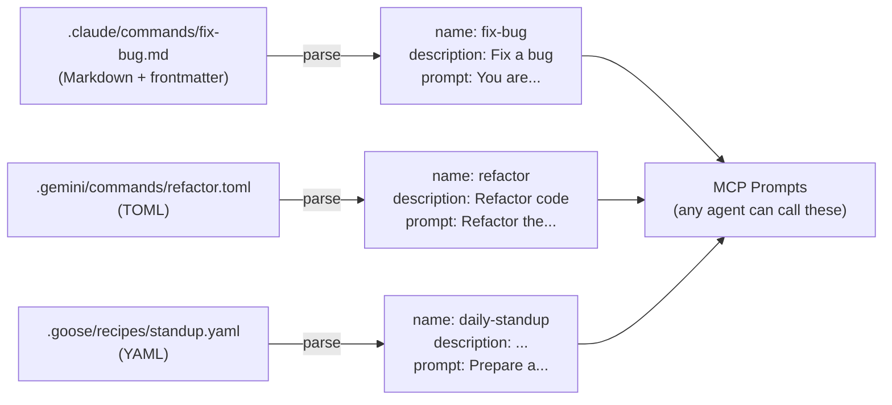
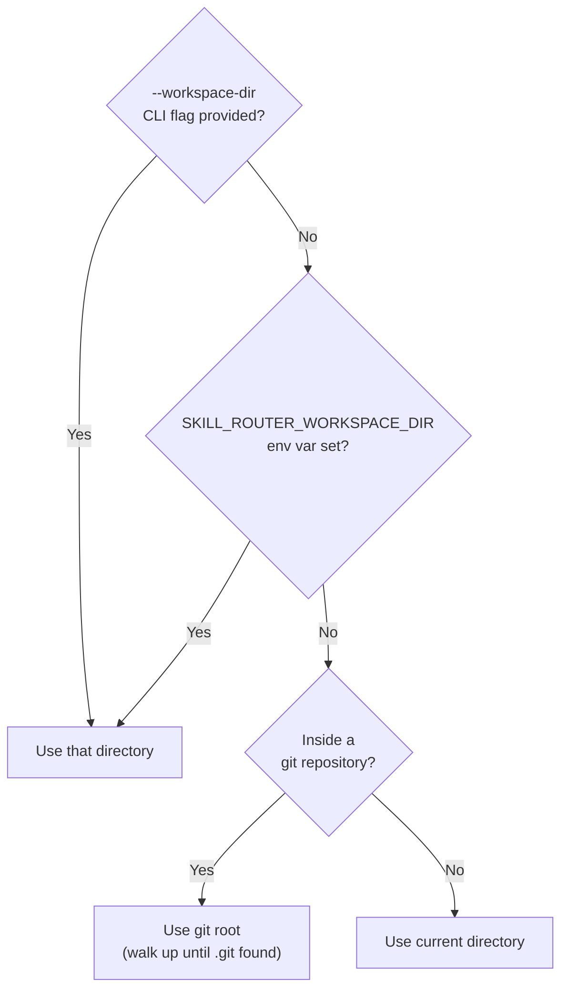
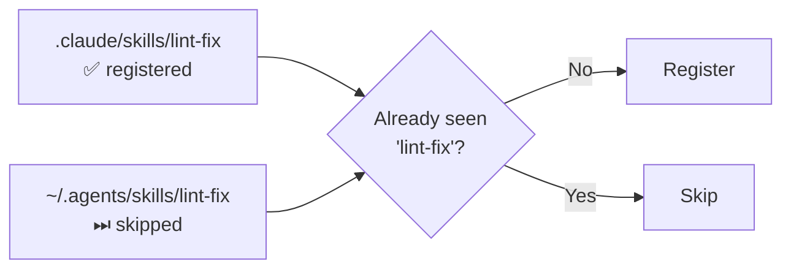

---
hide:
  - navigation
  - toc
---

# Concepts

This page explains the core ideas behind Agent Skill Router: what it is, how it works, and why it is structured the way it is.

---

## The proxy model

Agent Skill Router is, at its heart, a **format proxy**. It reads instructions written for Agent A and makes them available to Agent B — without any manual conversion.



Any MCP-compatible agent on the right side — Claude, Cursor, Copilot, Gemini, OpenCode, Goose, Codex — gets the same standardized output, regardless of which agent originally authored the instructions.

---

## Two things the router exposes

### 1. Skills (MCP Resources)

A **skill** is a directory with a `SKILL.md` file. The skill teaches an agent how to perform a specific task — writing tests, creating PRs, following a coding standard, etc.

The router discovers skill directories from every agent's native skill path and registers them as MCP resources. Every file inside the skill directory (scripts, references, templates) is individually listed.



### 2. Slash commands (MCP Prompts)

A **slash command** is a reusable prompt — a piece of text an agent sends to the LLM when you invoke a command like `/fix-bug` or `/review-code`.

Each agent stores slash commands in its own native format. The router reads all of them and re-exposes each as an MCP prompt with a normalized name.



---

## Discovery order and workspace resolution

The router needs to know *where* to look for skills and commands. It resolves the workspace root in this priority order:



This means the router always anchors workspace-level paths to the **repository root**, not the subdirectory you happen to be in when you start it.

---

## Two scopes: workspace vs user

Every provider (except `extra_dirs` and bundled skills) supports two scopes:

| Scope | Location | Activated by |
|---|---|---|
| **Workspace** | `<workspace-root>/.agents/skills/` | `SKILL_ROUTER_ENABLE_WORKSPACE_LEVEL=true` |
| **User** | `~/.agents/skills/` | `SKILL_ROUTER_ENABLE_USER_LEVEL=true` |

- **Workspace-scoped** skills are project-specific — checked into the repository.
- **User-scoped** skills are personal — shared across all your projects.

Both scopes are enabled by default. You can limit to one scope with the `--user` or `--workspace` flags on the `list` and `install` commands.

---

## Deduplication: first-wins

When the same skill name (or slash command name) appears in multiple providers, the **first one found wins**. Providers are iterated in a fixed order (Claude → Cursor → VSCode → Codex → Gemini → Goose → Copilot → OpenCode → Agents → OpenClaw → Bundled). Later duplicates are silently skipped.

This gives you a clear, deterministic override mechanism: place your customized version in `.claude/skills/` (first in the list) to override anything from user-level or bundled paths.



---

## The built-in `create-skill` prompt

The router ships with a bundled skill called `skill-creator` and a corresponding MCP prompt `create-skill`. When any connected agent calls this prompt, it receives detailed instructions for writing a new skill from scratch — including frontmatter format, body structure, eval loops, and output directory conventions.

```
create-skill(goal="Write a skill that runs our test suite", save_to_user_level=False)
```

The `save_to_user_level` parameter controls where the new skill is saved:
- `false` → `<workspace>/.agents/skills/<name>/`
- `true` → `~/.agents/skills/<name>/`

---

## Architecture overview

```mermaid
flowchart TB
    subgraph "CLI (cli.py)"
        CMD_LIST["list"]
        CMD_INSTALL["install"]
        CMD_RUN["run"]
        CMD_SETUP["setup-mcp"]
    end

    subgraph "Server (server.py)"
        WS["workspace_root()"]
        PROV["_PROVIDER_ROOTS\n(10 vendor providers)"]
        BUILD["build_mcp()"]
        WS --> BUILD
        PROV --> BUILD
    end

    subgraph "Agents (agents/)"]
        BASE["AgentSetupProvider ABC"]
        CLAUDE["ClaudeSetupProvider"]
        COPILOT["GitHubCopilotSetupProvider"]
        OTHERS["Cursor, OpenCode, Gemini,\nGoose, Codex..."]
        BASE --> CLAUDE
        BASE --> COPILOT
        BASE --> OTHERS
    end

    subgraph "Skills (_skills.py)"
        DISC["discover_skills(roots)"]
        INST["install_skill(src, dest)"]
    end

    subgraph "Settings (settings.py)"
        ENV["SKILL_ROUTER_* env vars\n(pydantic-settings)"]
    end

    CMD_RUN --> BUILD
    CMD_LIST --> DISC
    CMD_INSTALL --> INST
    CMD_SETUP --> CLAUDE
    CMD_SETUP --> COPILOT
    CMD_SETUP --> OTHERS
    ENV --> BUILD
    ENV --> CMD_LIST

    BUILD --> MCP["FastMCP instance\n(resources + prompts)"]
```
