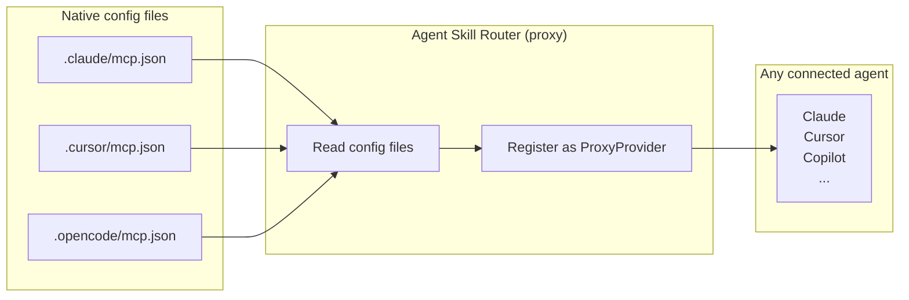

---
hide:
  - navigation
  - toc
---

# Configuration

Agent Skill Router is configured entirely through environment variables. All variables use the `SKILL_ROUTER_` prefix and follow pydantic-settings conventions.

---

## Environment variables

### Workspace

| Variable | Type | Default | Description |
|---|---|---|---|
| `SKILL_ROUTER_WORKSPACE_DIR` | `path` | (auto-detect) | Explicit workspace root. Overrides git-root detection. Also overridden by the `--workspace-dir` CLI flag. |

### Scope filters

| Variable | Type | Default | Description |
|---|---|---|---|
| `SKILL_ROUTER_ENABLE_WORKSPACE_LEVEL` | `bool` | `true` | Include workspace-scoped directories (`<workspace>/...`) |
| `SKILL_ROUTER_ENABLE_USER_LEVEL` | `bool` | `true` | Include user-scoped directories (`~/.../skills/`) |

### Bundled skills

| Variable | Type | Default | Description |
|---|---|---|---|
| `SKILL_ROUTER_ENABLE_BUNDLED` | `bool` | `true` | Include the `skill-creator` skill shipped inside the package |

### Per-agent toggles

Disable any provider entirely by setting its toggle to `false`.

| Variable | Default | Provider |
|---|---|---|
| `SKILL_ROUTER_ENABLE_CLAUDE` | `true` | `~/.claude/skills/` and `<ws>/.claude/skills/` |
| `SKILL_ROUTER_ENABLE_CURSOR` | `true` | `~/.cursor/skills/` and `<ws>/.cursor/skills/` |
| `SKILL_ROUTER_ENABLE_VSCODE` | `true` | `~/.copilot/skills/` and `<ws>/.copilot/skills/` |
| `SKILL_ROUTER_ENABLE_COPILOT` | `true` | `~/.copilot/skills/` and `<ws>/.copilot/skills/` |
| `SKILL_ROUTER_ENABLE_CODEX` | `true` | `~/.codex/skills/`, `/etc/codex/skills/` and `<ws>/.codex/skills/` |
| `SKILL_ROUTER_ENABLE_GEMINI` | `true` | `~/.gemini/skills/` and `<ws>/.gemini/skills/` |
| `SKILL_ROUTER_ENABLE_GOOSE` | `true` | `~/.config/agents/skills/` and `<ws>/.goose/skills/` |
| `SKILL_ROUTER_ENABLE_OPENCODE` | `true` | `~/.config/opencode/skills/` and `<ws>/.opencode/skills/` |
| `SKILL_ROUTER_ENABLE_AGENTS` | `true` | `~/.agents/skills/` and `<ws>/.agents/skills/` |
| `SKILL_ROUTER_ENABLE_OPENCLAW` | `true` | `~/.openclaw/skills/` and `<ws>/.openclaw/skills/` |

### MCP server proxy

| Variable | Type | Default | Description |
|---|---|---|---|
| `SKILL_ROUTER_ENABLE_MCP_PROXY` | `bool` | `true` | Read MCP servers from agent config files and proxy them to all connected agents |

When enabled, the router reads MCP server entries from each agent's config file and re-exposes them through a unified endpoint. This lets you configure an MCP server once (e.g., in Claude's `.claude/mcp.json`) and have it accessible from any other MCP-compatible agent.



Supported config files:
- `.claude/mcp.json` (Claude API)
- `.cursor/mcp.json` (Cursor)
- `.vscode/mcp.json` (GitHub Copilot / VS Code)
- `.opencode/mcp.json` (OpenCode)
- `~/.config/opencode/opencode.json` (OpenCode user config)

Servers are identified by name. When the same server name exists in multiple configs, the first one found wins.

!!! tip "Use case"
    If you use both Claude and Cursor, configure all your MCP servers in ONE agent's config file — Agent Skill Router makes them available to ALL agents automatically.

### Extra directories

| Variable | Type | Default | Description |
|---|---|---|---|
| `SKILL_ROUTER_EXTRA_DIRS` | `JSON array` | `[]` | Additional directories to scan. Always included regardless of scope flags. |

`extra_dirs` format — a JSON array of objects with a `path` key:

```bash
SKILL_ROUTER_EXTRA_DIRS='[{"path": "/shared/team-skills"}, {"path": "/opt/company-skills"}]'
```

---

## Setting variables in agent MCP config

You can pass environment variables directly in the MCP server entry:

=== "JSON (Claude, Cursor, Copilot)"
    ```json
    {
      "mcpServers": {
        "agent-skill-router": {
          "command": "uvx",
          "args": ["agent-skill-router", "run"],
          "env": {
            "SKILL_ROUTER_ENABLE_GOOSE": "false",
            "SKILL_ROUTER_WORKSPACE_DIR": "/path/to/project"
          }
        }
      }
    }
    ```

=== "YAML (Goose)"
    ```yaml
    extensions:
      agent-skill-router:
        type: stdio
        cmd: uvx
        args:
          - agent-skill-router
          - run
        env:
          SKILL_ROUTER_ENABLE_GOOSE: "false"
        enabled: true
    ```

=== "TOML (Codex)"
    ```toml
    [[mcp_servers]]
    name = "agent-skill-router"
    command = "uvx"
    args = ["agent-skill-router", "run"]
    env = { SKILL_ROUTER_ENABLE_GOOSE = "false" }
    ```

---

## Common recipes

### Only workspace skills (no user-global skills)

```bash
SKILL_ROUTER_ENABLE_USER_LEVEL=false agent-skill-router run
```

### Only user skills (ignore project-local)

```bash
SKILL_ROUTER_ENABLE_WORKSPACE_LEVEL=false agent-skill-router run
```

### Disable all vendor paths, use only `.agents/skills/`

```bash
SKILL_ROUTER_ENABLE_CLAUDE=false \
SKILL_ROUTER_ENABLE_CURSOR=false \
SKILL_ROUTER_ENABLE_VSCODE=false \
SKILL_ROUTER_ENABLE_COPILOT=false \
SKILL_ROUTER_ENABLE_CODEX=false \
SKILL_ROUTER_ENABLE_GEMINI=false \
SKILL_ROUTER_ENABLE_GOOSE=false \
SKILL_ROUTER_ENABLE_OPENCODE=false \
SKILL_ROUTER_ENABLE_OPENCLAW=false \
  agent-skill-router run
```

### Add a shared team skills directory

```bash
SKILL_ROUTER_EXTRA_DIRS='[{"path": "/mnt/shared/team-skills"}]' agent-skill-router run
```

### Fix the workspace root (useful in monorepos or CI)

```bash
SKILL_ROUTER_WORKSPACE_DIR=/workspace/my-service agent-skill-router run
# or via CLI flag:
agent-skill-router run --workspace-dir /workspace/my-service
```

---

## Priority: workspace resolution

When multiple sources specify the workspace root, this priority order applies:

```
--workspace-dir CLI flag  >  SKILL_ROUTER_WORKSPACE_DIR  >  git root  >  cwd
```

---

## `.env` file support

pydantic-settings does **not** auto-load `.env` files by default in this project. Use your shell or the agent MCP config `env` block to set variables.
