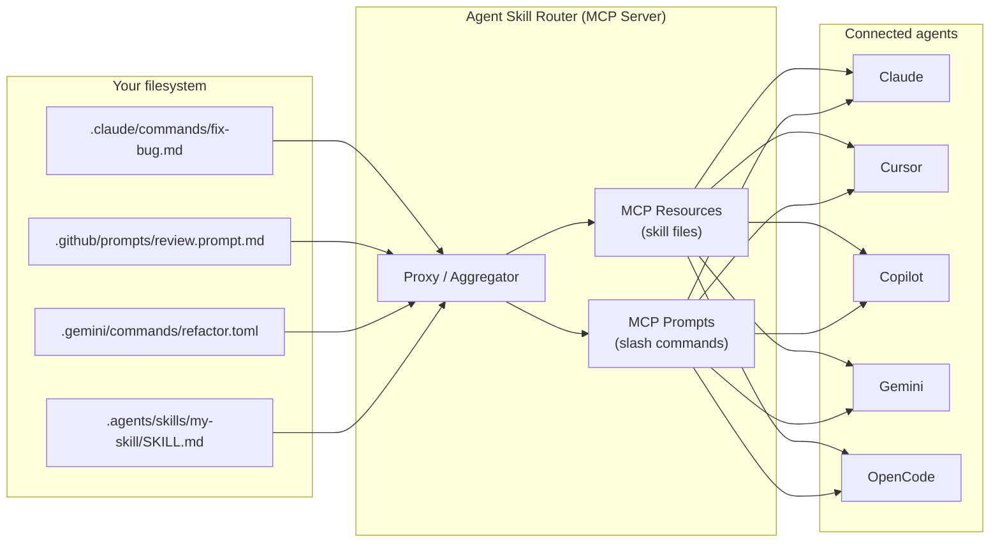

---
hide:
  - navigation
---

# Agent Skill Router

**Agent Skill Router** is an MCP (Model Context Protocol) server that acts as a **universal proxy** between AI coding agents. It discovers skills and slash commands from any agent's native format and makes them available to every other agent — with zero manual conversion.

---

## The problem it solves

Every AI coding agent stores its reusable instructions in a different place and format:

| Agent | Skill/command location | Format |
|---|---|---|
| Claude | `.claude/commands/*.md` | Markdown + YAML frontmatter |
| GitHub Copilot | `.github/prompts/*.prompt.md` | Markdown + YAML frontmatter |
| Cursor | `.cursor/rules/*.mdc` | Markdown + YAML frontmatter |
| Gemini | `.gemini/commands/**/*.toml` | TOML |
| Goose | `.goose/recipes/*.yaml` | YAML |
| Codex | `.codex/prompts/*.md` | Markdown + YAML frontmatter |
| OpenCode | `.opencode/commands/*.md` | Markdown + YAML frontmatter |

If you write a slash command for Claude, Cursor users can't use it. If you build a skill for Copilot, Gemini doesn't know it exists.

**Agent Skill Router fixes this.** It reads every agent's native format and re-exposes it through a single MCP endpoint.

---

## How it works — the proxy



The server reads **format A** (Claude Markdown, Gemini TOML, Goose YAML, …) and exposes **format B** (standardized MCP resources and prompts) — accessible by any MCP-compatible agent.

---

## Quick start

### 1. Install

```bash
uvx agent-skill-router setup-mcp
```

This auto-detects installed agents and writes the MCP server entry into each one's config file.

### 2. Manual install (any agent)

Add the following to your agent's MCP configuration:

```json
{
  "mcpServers": {
    "agent-skill-router": {
      "command": "uvx",
      "args": ["agent-skill-router", "run"]
    }
  }
}
```

### 3. Verify

```bash
agent-skill-router list
```

Lists every skill and slash command the server would expose.

---

## Key features

- **Universal skill discovery** — scans `.claude/skills/`, `.cursor/skills/`, `.agents/skills/`, `~/.agents/skills/`, and [10+ vendor paths](agents.md)
- **Cross-agent slash commands** — reads native command files from every agent and exposes them all as MCP prompts
- **First-wins deduplication** — same skill or command name in multiple agents: the first one found wins; no conflicts
- **Bundled `skill-creator`** — a built-in skill that teaches any agent how to write new skills
- **`--workspace-dir`** — explicit workspace root, overriding git-root auto-detection
- **Per-provider toggles** — disable any agent's directory via `SKILL_ROUTER_ENABLE_<AGENT>=false`
- **Zero conversion needed** — write skills once in any format, use everywhere

---

## Next steps

- [Concepts](concepts.md) — understand the proxy model in depth
- [Supported Agents](agents.md) — full list of providers and their paths
- [Writing Skills](skills.md) — SKILL.md format and examples
- [Slash Commands](slash-commands.md) — how cross-agent command sharing works
- [CLI Reference](cli.md) — all commands and flags
- [Configuration](configuration.md) — environment variables and settings
