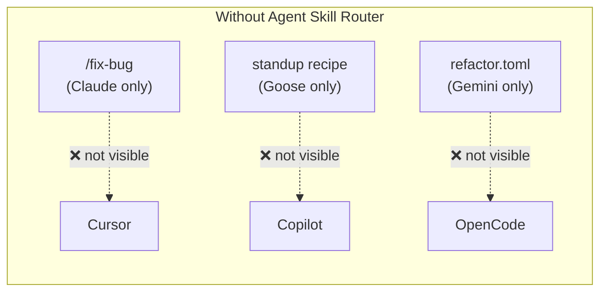
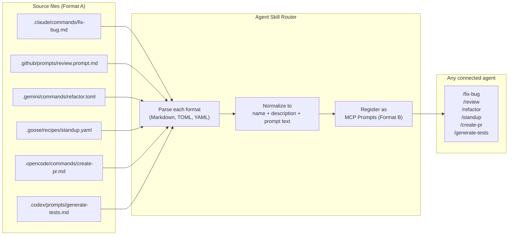

---
hide:
  - navigation
---

# Slash Commands

Agent Skill Router exposes slash commands written for one agent as MCP prompts accessible to every other agent. This page explains how the sharing works and what native formats are supported.

---

## The problem

Every agent has its own native slash command format and location. A `/fix-bug` command written for Claude is invisible to Cursor. A Goose recipe is unknown to Gemini.



---

## The solution

The router reads every agent's native command files and re-exposes them as standardized MCP prompts. Any connected agent can call any command, regardless of who wrote it.



---

## Supported native formats

### Claude — Markdown + frontmatter

**Location:** `.claude/commands/*.md`

```markdown title=".claude/commands/fix-bug.md"
---
description: Find and fix a bug in the codebase
allowed-tools: Bash, Read, Edit
---

You are an expert debugger. Analyze the reported bug carefully...
```

- `name` → file stem (`fix-bug`)
- `description` → `description` frontmatter field
- `prompt` → file body (frontmatter block stripped)

---

### GitHub Copilot — Markdown + frontmatter

**Location:** `.github/prompts/*.prompt.md`

```markdown title=".github/prompts/review-code.prompt.md"
---
description: Review code for quality and correctness
mode: ask
---

Review the selected code thoroughly. Check for...
```

- `name` → file stem with `.prompt` suffix removed (`review-code`)
- `description` → `description` frontmatter field
- `prompt` → file body

---

### Cursor — MDC / Markdown + frontmatter

**Location:** `.cursor/rules/*.mdc`, `.cursor/rules/*.md`

```markdown title=".cursor/rules/typescript.mdc"
---
description: Apply TypeScript best practices
globs: **/*.ts
---

Always use strict TypeScript. Prefer interfaces over types...
```

- `name` → file stem (`typescript`)
- `description` → `description` frontmatter field
- `prompt` → file body

---

### OpenCode — Markdown + frontmatter

**Location:** `.opencode/commands/*.md`

```markdown title=".opencode/commands/create-pr.md"
---
description: Create a pull request with a summary of changes
---

Analyze the current git diff and staged changes. Write a PR...
```

- `name` → file stem (`create-pr`)
- `description` → `description` frontmatter field
- `prompt` → file body

---

### Codex — Markdown + frontmatter

**Location:** `.codex/prompts/*.md`

```markdown title=".codex/prompts/generate-tests.md"
---
description: Generate unit tests for the selected code
---

Write comprehensive unit tests for the following code...
```

- `name` → file stem (`generate-tests`)
- `description` → `description` frontmatter field
- `prompt` → file body

---

### Gemini — TOML

**Location:** `.gemini/commands/**/*.toml`

```toml title=".gemini/commands/refactor.toml"
description = "Refactor selected code for clarity and performance"
prompt = "Refactor the following code. Improve naming, reduce complexity..."
```

Nested files use `:` as a namespace separator:

```toml title=".gemini/commands/git/commit.toml"
description = "Write a conventional commit message"
prompt = "Write a commit message following the Conventional Commits spec..."
```

→ registered as `git:commit`

- `name` → path parts joined by `:`, extension stripped
- `description` → `description` key
- `prompt` → `prompt` key

---

### Goose — YAML

**Location:** `.goose/recipes/*.yaml`

```yaml title=".goose/recipes/standup.yaml"
title: daily-standup
description: Prepare a daily standup summary from recent git activity
instructions: |
  Look at the git log for the last 24 hours and summarize what was done.
  Format the summary as bullet points suitable for a standup meeting.
```

- `name` → `title` field (or file stem if `title` is absent)
- `description` → `description` field
- `prompt` → `instructions` field (falls back to `prompt` key)

---

## Deduplication

When the same command name appears in multiple agents' directories, **the first provider wins**. The fixed scan order is:

1. Claude (`.claude/commands/`)
2. GitHub Copilot (`.github/prompts/`)
3. Cursor (`.cursor/rules/`)
4. OpenCode (`.opencode/commands/`)
5. Gemini (`.gemini/commands/`)
6. Goose (`.goose/recipes/`)
7. Codex (`.codex/prompts/`)

`create-skill` is always reserved — even if a native file uses that name, it is skipped.

---

## Scope: workspace vs user

The router scans command files from two locations for each agent:

| Scope | Location |
|---|---|
| Workspace | `<workspace-root>/.claude/commands/`, `.github/prompts/`, etc. |
| User | `~/` (home directory equivalent for each agent) |

Both scopes are enabled by default. Disable with:

```bash
SKILL_ROUTER_ENABLE_WORKSPACE_LEVEL=false  # skip workspace commands
SKILL_ROUTER_ENABLE_USER_LEVEL=false       # skip user-level commands
```

---

## The built-in `create-skill` prompt

The router always registers a `create-skill` MCP prompt, regardless of what files exist on disk. It is the only parametric prompt:

```
create-skill(goal: str, save_to_user_level: bool = False)
```

| Parameter | Description |
|---|---|
| `goal` | What skill to create — describe the task in plain English |
| `save_to_user_level` | `false` = save to `<workspace>/.agents/skills/`; `true` = save to `~/.agents/skills/` |

This prompt loads the bundled `skill-creator` skill and instructs the agent to write a new skill from scratch.

---

## Verifying registered prompts

```bash
agent-skill-router list
```

The `PROMPTS` section shows every slash command the server will expose:

```
PROMPTS
  NAME            DESCRIPTION
  ----------------------------------------------------------
  create-skill    Create a new skill from scratch
  fix-bug         Find and fix a bug in the codebase
  review-code     Review code for quality and correctness
  refactor        Refactor selected code for clarity
  daily-standup   Prepare a daily standup from git activity
  generate-tests  Generate unit tests for selected code
```
